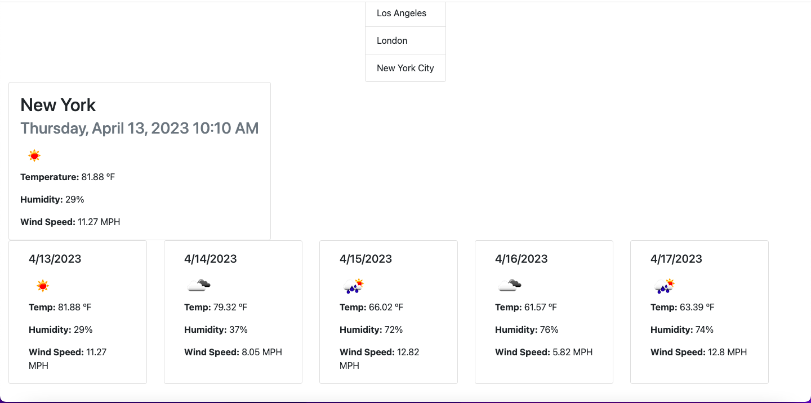

# Weather-Dashboard

## Description
My motivation for this project was to better my skills to hopefully prepare myself for a job in the field in the upcoming future. I built this project with the intention of building a project using server side APIs. This application solves the need of knowing the weather and 5 day forecast in the city you are in or anywhere else. I learned how to use fetch functions for APIs, I learned how to manipulate a server side API URL to get various information, and I learned how to create a search history that is shown on the page and stored in local storage.

## Installation
To install this application go to the url "https://pjt3232.github.io/Weather-Dashboard/" on the browser of your choice.

## Usage
To use this application, go to the url "https://pjt3232.github.io/Weather-Dashboard/". The application should look like the screenshot below:

To use this application just type in a city name in the search bar that says "Enter a city" and click the search button. This will add the city to your search history which has a maximum amount of 10 cities at a time and then pull up the weather for the current day and the 5 day forecast. The current day and 5 day forecast shows an icon that generally describes the weather conditions, the temperature in ºF, the humidity in %, and the wind speed in MPH. The weather for the 5 day forecast will show the weather at this current time on the that specific day. Another feature is you can select a city from the search history list and the weather and forecast for that city will appear.

## Credits
I did not use a third party starter code for this project or have any collaborators.
